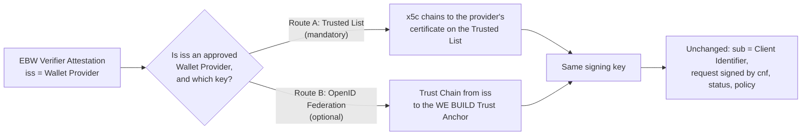

# Mutual identification for European Business Wallet presentation requests

**Authors/Contributors:**

- Florin Coptil, Bosch, Germany
- Werner Folkendt, Bosch, Germany
- Lal Chandran, iGrant.io, Sweden
- George J Padayatti, iGrant.io, Sweden
- Eelco Klaver, Credenco, The Netherlands
- <Please add more .. >

**Obsoletes:** N/A

## Context

An EBW in the Holder role stores attestations that its owner treats as confidential, such as ultimate beneficial ownership and control structure. In the BU use cases, requests arrive backend to backend with no person present. The Holder EBW must decide alone, so it needs three answers a machine can check:

1. Which legal entity is asking?
2. Is the requesting software a real wallet unit, and is it still valid?
3. Does the owner's policy allow this entity to receive this attestation?

The proposed Regulation on the establishment of European Business Wallets, COM(2025) 838 final of 19 November 2025, addresses this in its Annex. Point 14(2)(b) states that "where Business Wallet owners use their Business Wallets unit to interact with competent national authorities and providers of electronic attestations of attributes, Wallet units shall enable authentication and validation of the Wallet unit components by presenting the Wallet unit attestations to those competent national authorities and providers upon their request".

Point 14 covers the issuance direction, and CS-01 already implements it. The proposal places no equivalent obligation on a party that requests attestations from a Wallet unit. That gap is what this decision fills.

**We already solve this for issuance.** In CS-01, a Wallet Unit proves what it is before an Issuer releases anything:

- it authenticates with an attestation, the WIA, per OpenID4VCI Appendix E, sent with its Proof-of-Possession (CS-01 section 7.4)
- the attestation is bound to the key used in the transaction, through `cnf` (CS-01 section 7.4)
- `client_id` equals the `sub` claim of the attestation (CS-01 sections 7.3 and 7.4)
- the attestation is checked against the Trusted List for Wallet Providers (CS-01 section 7.4)
- revocation is checked, and re-checked later (CS-01 section 7.5, CS-04 section 7.2)

**In presentation, this rule applies in one direction only.** CS-02 section 7.2, item 6 requires the Verifier to validate the Holder's Wallet Unit Attestation. Nothing requires the Verifier to prove the same about itself. Today it is identified only as the party that signed the request (CS-02 sections 5 and 8.2). The request carries no EBWOID and no BWUA.

The requester already holds both. An EBW is a single wallet unit that plays the Holder, Issuer, and Verifier roles ([BWUA based on TS3](bwua-ts3-attestation.md), CS-02 chapter 4). Nothing new has to be issued to it. What is missing is an agreed way to present what it already holds.

**Two places can carry this material.**

| | `verifier_attestation` Prefix, OpenID4VP 5.9.3 and 12 | `verifier_info`, OpenID4VP 5.11 |
| --- | --- | --- |
| Link to the request | The attestation contains the Verifier's public key (`cnf`). The request signature proves the sender holds the matching private key, so the attestation cannot be copied into another party's request. This is the method CS-01 section 7.4 already uses | We must define this link ourselves. Without it, an entry can be copied into another party's request |
| Relation to CS-02 | Already an allowed scheme, section 5 | Not used today |
| Identity carriers per request | One | Two, checked alongside `client_id` |

Legal entities that run an EUDI Relying Party component hold neither an EBWOID nor a BWUA. Making a parameter mandatory for all requests would exclude them from all traffic, including data that the KYC and PA3 use cases depend on and that is not confidential. The reverse also holds: an EBW may itself request attestations from an EUDI Wallet, and in that direction the EUDI ecosystem's own relying party rules apply.

**One question OpenID4VP leaves to us.** With the `verifier_attestation` prefix, OpenID4VP fixes almost everything the receiving wallet does: take the attestation from the `jwt` header, check `typ` and `exp`, match `sub` to the Client Identifier, and check that the request is signed with the `cnf` key. It leaves exactly one question open. Section 12 states that how the wallet comes to trust the attestation's issuer, and how it obtains the issuer's public key, "is out of scope of this specification". Each ecosystem must answer it. This decision answers it with the Trusted List for Wallet Providers, and shows that OpenID Federation can answer it too, without changing anything else (Decision 2).

## Decision

This decision changes nothing in OpenID4VP, nothing in the CS-02 request and response flows, and nothing in the attestations defined in CS-04 and CS-05. It prescribes, for EBW-to-EBW traffic, which already-standard Client Identifier Prefix an EBW uses, and it introduces one new artefact, the EBW Verifier Attestation, which reuses the wallet unit identifier and status mechanism defined in CS-05 and is expected to be specified alongside it. The request format is plain OpenID4VP section 5.9.3. What a receiving EBW adds is the WE BUILD rule for trusting the attestation's issuer, which OpenID4VP deliberately leaves open (Decision 2).

### 1. Apply the same rule in both directions, using the issuance method

WE BUILD defines the EBW Verifier Attestation, a profile of the OpenID4VP Verifier Attestation JWT (section 12), presented with the `verifier_attestation` Client Identifier Prefix (section 5.9.3), which CS-02 section 5 already allows. It is a single JWT, placed in the `jwt` JOSE header of the request object as section 5.9.3 requires.

**The Client Identifier is the EBWOID.** The request carries `client_id = verifier_attestation:<EBWOID>`, and the attestation's `sub` is the same EBWOID. OpenID4VP does not require the Client Identifier to be a URL; its own example is `verifier_attestation:verifier.example`. Under this prefix the Client Identifier is never resolved or looked up. The receiving wallet only checks that it equals `sub`. The EBWOID is therefore the single identity carrier in the request, and it is the key the owner's policy uses (Decision 4).

The EBW Verifier Attestation MUST contain:

- `typ` JOSE header `verifier-attestation+jwt`, as OpenID4VP section 12 requires
- `iss`: the identifier of the Wallet Provider of the requesting wallet unit
- `sub`: the EBWOID of the legal entity operating the requesting wallet unit, equal to the Client Identifier without its `verifier_attestation:` prefix
- the wallet unit identifier and the status reference of the requesting wallet unit, as defined for the BWUA in CS-05, so that the Holder can check validity and revocation without resolving a second artefact
- a `cnf` claim whose key signs the Presentation Request Object, so that the signature proves the sender holds that key
- `exp`

Example (illustrative values):

```json
// Request Object payload (excerpt), signed with the key in cnf
{
  "client_id": "verifier_attestation:EBWOID-XX-WEBUILDSHOP",
  "response_uri": "https://ebw.webuildshop.example/oid4vp/cb",
  "nonce": "q8v1…",
  "dcql_query": { … },
  "client_metadata": { … }
}

// EBW Verifier Attestation, carried in the jwt JOSE header of the Request Object
// JOSE header
{ "typ": "verifier-attestation+jwt", "alg": "ES256", "kid": "va-a-2026",
  "x5c": [ "MIIB… leaf certificate" ] }
// payload
{
  "iss": "https://provider-a.example",
  "sub": "EBWOID-XX-WEBUILDSHOP",
  "exp": 1790086400,
  "cnf": { "jwk": { … requesting wallet unit key … } },
  "wallet_unit_id": "…",
  "status": { "status_list": { "idx": 881, "uri": "https://provider-a.example/status/3" } }
}
```

The EBW Verifier Attestation is issued and signed by the Wallet Provider of the requesting wallet unit. The Wallet Provider verifies the EBWOID binding at onboarding and asserts it in the attestation; the EBWOID provider is not the trust anchor. The BWUA artefact itself is neither embedded nor fetched: the Wallet Provider signs both the BWUA and the EBW Verifier Attestation, so the attestation restates the same facts under the same signature and the same trust path. Because the `jwt` header carries one attestation, one issuer must vouch for both the legal entity and the wallet unit. The Wallet Provider is the only party that already does both, through the BWUA.

**Issuance is not per request.** The requesting EBW obtains its EBW Verifier Attestation from its Wallet Provider and reuses it for every request until it expires. This is safe because every request is signed with the private key behind `cnf`, so a copied attestation is useless to anyone else; OpenID4VP section 12 describes this as allowing the Verifier to "use it for a long time independent of that issuer". Load on the Wallet Provider therefore depends on the number of wallet units it hosts and the validity period, not on request volume, and the Wallet Provider is not involved in the request path. The attestation SHOULD be valid between 24 hours and 7 days, and the requesting EBW SHOULD renew it before expiry, for example at two thirds of its lifetime, so that a short Wallet Provider outage does not interrupt its traffic.

### 2. Trust in the issuer: the Trusted List, and optionally OpenID Federation

The receiving EBW must answer one question before any other check has meaning: **is the attestation's `iss` an approved Wallet Provider, and which key verifies its signature?** OpenID4VP leaves this to the ecosystem (section 12). WE BUILD defines two routes. Both lead to the same answer, and nothing else in the processing depends on which one is used.



**Route A: the Trusted List for Wallet Providers (mandatory).** Every EBW acting as Holder MUST support this route. The attestation carries the Wallet Provider's certificate chain in its `x5c` header. The receiving EBW builds a certification path from the leaf certificate to a certificate listed for that Wallet Provider in the Trusted List for Wallet Providers, checks that the entry has status granted, and verifies the attestation with the leaf key. This is the path CS-01 section 7.4 already runs for the WIA.

**Route B: OpenID Federation (optional).** An EBW acting as Holder MAY additionally accept trust established through OpenID Federation 1.0. This works with the `verifier_attestation` prefix for three reasons, which together also define the WE BUILD profile for this route:

1. **The receiving EBW resolves a Trust Chain for `iss`, not just its metadata.** A Wallet Provider's own metadata, its Entity Configuration, is self-signed, so on its own it proves nothing. The receiving EBW builds and validates a Trust Chain from the `iss` up to a Trust Anchor it is configured to trust, as OpenID Federation 1.0 specifies. Only then are the metadata, and the signing key in them, trustworthy. The chain can arrive in the attestation's `trust_chain` JOSE header, which allows validation without network calls, or the receiving EBW can fetch it starting from `https://<iss>/.well-known/openid-federation`.

2. **It works because OpenID4VP leaves this open, not because OpenID4VP defines it.** Federation fills the gap left by section 12 as a WE BUILD profile. A plain OpenID4VP wallet does not do this on its own. For this route, WE BUILD specifies that:
   - `iss` is the Wallet Provider's Federation Entity Identifier, an HTTPS URL;
   - the attestation signing key is published in the `jwks` of a dedicated Entity Type in the Wallet Provider's metadata: `openid_verifier_provider`, as proposed in the draft `openid/federation-wallet` PR #72, or `openid_wallet_provider`; the choice is open (see Risks);
   - the attestation's `kid` identifies that key, and the key MUST NOT be taken from the Wallet Provider's Federation Entity Keys, which OpenID Federation 1.0 reserves for federation statements;
   - the WE BUILD Trust Anchor issues a Subordinate Statement about a Wallet Provider only while that provider is listed with status granted in the Trusted List for Wallet Providers, and stops when it is not;
   - the published key SHOULD carry an `x5c` that chains to the same listed certificate, so that Route A and Route B identify the same key.

3. **Only `iss` is resolved.** The Client Identifier and `sub` stay what the `verifier_attestation` prefix defines: they are matched against each other and never resolved, and Verifier metadata still comes from `client_metadata`. OpenID Federation resolution of the Client Identifier belongs to the `openid_federation` prefix, which this decision does not use. That is why the Client Identifier can be the EBWOID, which is not a Federation Entity Identifier.

Example (illustrative values) of what the receiving EBW validates on Route B:

```json
// trust_chain[0]: Entity Configuration of the Wallet Provider, self-signed with fed-a-1
{
  "iss": "https://provider-a.example",
  "sub": "https://provider-a.example",
  "jwks": { "keys": [ { "kid": "fed-a-1", … } ] },
  "authority_hints": [ "https://ta.webuild.example" ],
  "metadata": {
    "openid_verifier_provider": {
      "jwks": { "keys": [ { "kid": "va-a-2026", …, "x5c": [ "MIIB… leaf", "MIIC… listed CA" ] } ] }
    }
  }
}

// trust_chain[1]: Subordinate Statement about the Wallet Provider, signed by the Trust Anchor
{
  "iss": "https://ta.webuild.example",
  "sub": "https://provider-a.example",
  "jwks": { "keys": [ { "kid": "fed-a-1", … } ] }
}
```

The receiving EBW checks the Subordinate Statement with the Trust Anchor key it is configured with, checks the Entity Configuration with `fed-a-1`, and verifies the attestation with `va-a-2026`. The result is the same as Route A: the Wallet Provider is trusted, and this is its key.

**The Trusted List stays the single root of trust.** Because the Trust Anchor admits only listed Wallet Providers, the two routes cannot disagree. Route B changes how the evidence is delivered and checked, not who decides. The receiving EBW's configuration decides which routes it accepts; the requester cannot choose the route by choosing which header to send. If trust cannot be established on an accepted route, the receiving EBW MUST refuse the request, as OpenID4VP section 5.9.3 requires.

### 3. When the attestation is required

An EBW acting as Verifier MUST include its EBW Verifier Attestation in every Presentation Request addressed to another EBW, or requesting an attestation type governed by an EBW rulebook. An EBW always holds an EBWOID and a BWUA, so it can always comply. An attestation rulebook MAY declare that a given attestation type MUST NOT be released unless the request carries a valid EBW Verifier Attestation, and an owner MAY apply stricter rules for its own wallet. A valid attestation does not by itself give a right to a response.

**This obligation does not apply to interactions with EUDI Wallets.** An EBW can also act as Verifier towards an EUDI Wallet, for example to request a PID or an attestation from a natural person. In that direction the EBW follows the rules of the EUDI ecosystem, using the Client Identifier Prefix it mandates, in practice `x509_san_dns` with a Relying Party access certificate. Nothing in this decision requires an EUDI Wallet to support the `verifier_attestation` prefix or to trust EBW attestation providers.

Verifiers that are not EBWs are not excluded in the other direction either. Their requests carry no EBW Verifier Attestation, and the Holder decides what to release under Decision 4, using the Client Identifier Schemes CS-02 section 5 already allows.

### 4. One place where policy is decided

The validated attestation is an input to the automatic approval list from [EBW EAA exchange automation](EBW-EAA-exchange-automation.md), not a second gate in front of it. The list is keyed on the EBWOID from the Client Identifier and `sub`. Where the owner approved a requester and attestation combination in advance, that approval is the Holder's consent for CS-02 section 7.1, and the wallet unit MUST record the release and show it to the owner. Otherwise it MUST ask the owner or reject. The choice of trust route in Decision 2 does not affect this list.

### Processing summary for the receiving EBW

| Step | Check | Depends on the trust route? |
| --- | --- | --- |
| 1. Who is asking | Read the prefix; take the attestation from the `jwt` header; the EBWOID is the Client Identifier without its prefix | No |
| 2. Is the issuer trusted, and with which key | Route A: `x5c` to the Trusted List. Route B: Trust Chain from `iss` to the Trust Anchor | **Yes, only here** |
| 3. Is the attestation valid | Signature with the key from step 2; `typ`; `exp` | No |
| 4. Is the request bound to it | `sub` equals the Client Identifier without its prefix; the request is signed with the `cnf` key | No |
| 5. Is the wallet unit still valid | Status reference | No |
| 6. May this entity receive this attestation | Owner's approval list, keyed on the EBWOID (Decision 4) | No |

### What this decision does not change

| Area | Already decided in |
| --- | --- |
| Protocols | [Baseline protocols](base-protocols.md) |
| OpenID4VP request and response processing | OpenID4VP 1.0, used as published; only the choice of Client Identifier Prefix, the content of the attestation JWT and the rule for trusting its issuer are profiled |
| OpenID Federation | OpenID Federation 1.0, used as published, and only to establish trust in the attestation's issuer |
| Signed requests, `client_id`, allowed schemes, nonce, audience, expiry | CS-02 sections 5, 6.1.1, 6.1.3, 8.2 |
| Attestation structure, validity, revocation, binding | CS-04 for the WUA, CS-05 for the BWUA, both authoritative |
| Trust lists | [Trusted lists](trusted-lists.md), applied in CS-01 section 7.4 |
| What a Verifier checks in a response | CS-02 section 7.2, item 6 |

## Consequences

### What becomes easier?

A Holder EBW can identify the requesting entity and check that its wallet unit is sound and not revoked, using material the requester already holds and a verification path its implementation already runs for issuance. Owners can accept requests they refuse today.

Requests can be answered without a person present, which is a precondition for using the EBW inside internal systems. Consent is given once, by the owner, in a list the owner controls.

There is one identity carrier, the EBWOID, one binding rule, one root of trust and one revocation path, in both directions. Testing extends what exists instead of adding a second surface.

Wallet Providers that already operate in an OpenID Federation, or partners outside the reach of the Trusted List, can be accommodated through Route B without changing the request format, the attestation claims or the owner's approval list. On Route B, the evidence can travel with the request, and a Wallet Provider can rotate its attestation signing key by publishing it in its own metadata.

### What becomes more difficult?

Wallet Providers must issue an EBW Verifier Attestation for each wallet unit and keep its revocation status in step with the BWUA: the provider MUST revoke the EBW Verifier Attestation whenever it revokes the corresponding BWUA, or issue it short lived so that alignment happens by expiry. Where a customer runs only a Relying Party component, the provider must decide whether to give it EBW-bound material.

Owners must decide which attestations are confidential. Classification will vary until common practice develops.

Requesters without EBW-bound material will not receive confidential attestations. For KYC and PA3 this must be explained before participants design their integration.

If Route B is used, someone must operate the WE BUILD Trust Anchor and keep its Subordinate Statements aligned with the Trusted List, and Holders that accept Route B must implement Trust Chain validation. Holders that accept only Route A are not affected.

### How do we address the risks introduced by this change?

Wallet Providers can enable a Relying Party component to hold and present an EBW Verifier Attestation, for example by supplying the holder component with the verifier service.

The pre-flight specification should publish a default classification for the BU1 attestation types, so owners start from a common baseline.

The Trusted List route needs a defined link between `iss` and the listed entry, for example a URI in the leaf certificate equal to `iss`. The WE BUILD trust profile must fix this.

The Entity Type for Route B depends on `openid/federation-wallet` PR #72, which is not yet merged. Until it is, WE BUILD can use `openid_wallet_provider`, which the Wallet Provider already publishes, and align later. Route B remains optional, so this does not block Route A.

Because `sub` is the EBWOID, the requesting organisation itself is not resolved through OpenID Federation, and sector bodies cannot publish per-organisation policy through it. The owner's approval list covers this need. If per-organisation policy through Federation is wanted later, each EBW can be given an HTTPS Entity Identifier in addition to its EBWOID, without changing Decisions 1, 3 and 4.

If the Architecture Group decides that the Client Identifier layer cannot carry this material, the same requirements can be written in the `verifier_info` format: authentication stays at the Client Identifier layer, using the prefix the target ecosystem supports, and the EBWOID and wallet unit claims travel in `verifier_info` under a WE BUILD profile that defines the binding to the request signature. Decision 1 then changes, Decisions 2, 3 and 4 stand, and the profile must additionally define the link between the entry and the request that section 12 provides by default.

## References

- [OpenID for Verifiable Presentations 1.0](https://openid.net/specs/openid-4-verifiable-presentations-1_0.html), sections 5.9.3 and 12
- [OpenID Federation 1.0](https://openid.net/specs/openid-federation-1_0.html)
- [OpenID Federation for Wallet Architectures 1.0](https://openid.net/specs/openid-federation-wallet-1_0.html), draft 05, and [PR #72](https://github.com/openid/federation-wallet/pull/72)
- ETSI TS 119 612 (Trusted Lists) and ETSI TS 119 602 (Lists of Trusted Entities)

## Advice

Once merged, this is our consortium's decision. This does not mean all participants agree it is the best possible decision. In the decision-making process, we have heard the following advice.

- All authors / Contributors
- yyyy-mm-dd, Name, Affiliation, Country: OK or summary of advice
